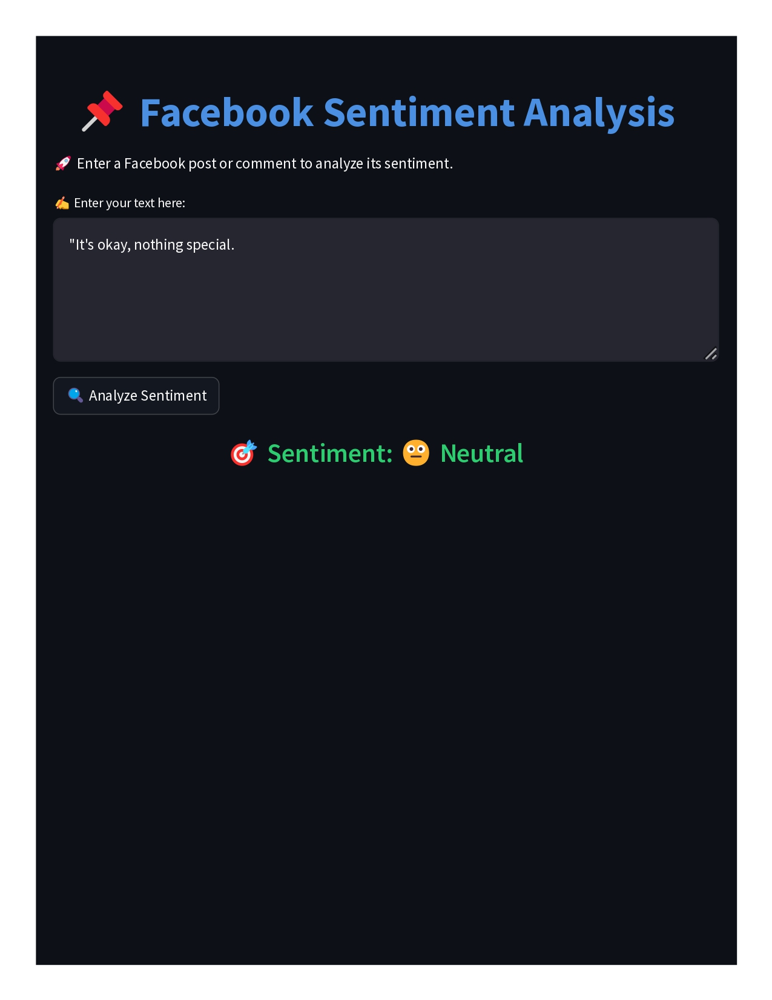
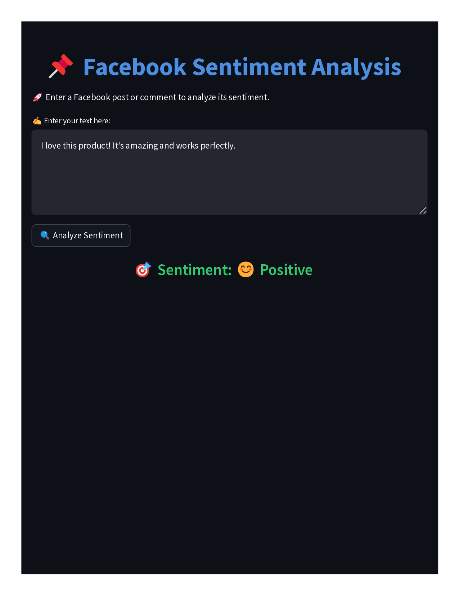

# 📌 Facebook Sentiment Analysis with Random Forest  
 

## 🚀 Overview  

This project is a **Facebook Sentiment Analysis** tool built with **Streamlit** and **Random Forest**. It allows users to enter Facebook comments or posts and predicts their sentiment as **Positive 😊, Neutral 😐, or Negative 😡** using a trained **Random Forest model** 
---

## 🛠️ Features  

- ✅ **Pretrained Random Forest model** for sentiment classification  
- ✅ **Text preprocessing** (removal of URLs, special characters, and stopwords)  
- ✅ **TF-IDF vectorization** for text transformation  
- ✅ **Beautiful Streamlit UI** with emoji-based sentiment display  
- ✅ **Easy deployment** and lightweight execution  

---

## 📸 Screenshots  

### 🔹 **User Interface**  

 

### 🔹 **Sentiment Analysis in Action**  
  

---

## 📦 Installation  

1️⃣ **Clone the repository**  
```bash
git clone https://github.com/Bibekbb/Facebook-Sentiment-Analysis.git
cd facebook-sentiment-analysis
```  

2️⃣ **Create a virtual environment (optional but recommended)**  
```bash
python -m venv venv
source venv/bin/activate  
venv\Scripts\activate      
```  

3️⃣ **Install dependencies**  
```bash
pip install -r requirements.txt
```  

4️⃣ **Run the Streamlit app**  
```bash
streamlit run app.py
```  

---

## 📁 Project Structure  

```
facebook-sentiment-analysis/
│── assets/                    
│   ├── positive.png
│   ├── negative.png
│
│── model/                    
│   ├── sentiment_model.pkl 
│   ├── tfidf_vectorizer.pkl
│
│── data/                    
│   ├── Facebook Sentiment Analysis .ipynb
│   ├── fb_sentiment.csv
│
│── app.py                     
│── requirements.txt            
│── README.md            
```

---

## 🎯 Usage  

1️⃣ Open the **web interface**  
2️⃣ Enter a **Facebook comment/post**  
3️⃣ Click **Analyze Sentiment**  
4️⃣ View the **sentiment prediction**  

---

## ⚡ Example Inputs & Predictions  

| Input Text | Prediction |
|------------|------------|
| `"I love this product! It's amazing!"` | 😊 Positive |
| `"This is okay, nothing special."` | 😐 Neutral |
| `"Worst experience ever! Never buying again."` | 😡 Negative |


---

## 💡 Future Enhancements  

- 🔹 Improve model performance with **deep learning**  
- 🔹 Add **BERT-based sentiment analysis**  
- 🔹 Enable **real-time Facebook comment scraping**  

--- 

---

## 📜 License  

This project is **MIT licensed**. See the [LICENSE](LICENSE) file for details.  

---

Give a ⭐ if you found this useful! 😊  
